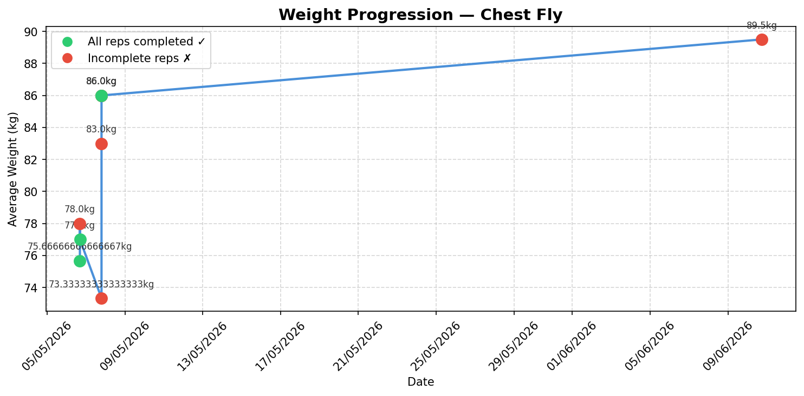

# 💪 Smart Gym Progression System

A data-driven workout tracking system that automates progressive overload — the core principle behind strength training gains.

Most gym apps just log data. This one **thinks**. It analyses your performance after every session and tells you exactly what to do next.

---

## 🎯 Features

- **Progressive overload engine** — automatically recommends weight increases, maintenance, or deloads based on your performance history
- **Plateau detection** — identifies when you've stalled and triggers a structured deload
- **Weight progression charts** — visualise your strength gains over time per exercise
- **Volume tracking** — monitor total training load across sessions
- **Weekly performance summaries** — week-on-week comparison of volume and completion rate
- **Personal records tracker** — all-time bests per exercise across weight and volume
- **CSV export** — export your full workout history for analysis in Excel or Google Sheets
- **SQLite database** — structured relational data storage with a 3-table schema

---

## 🛠️ Tech Stack

| Layer | Technology |
|---|---|
| Language | Python 3.11 |
| Data analysis | pandas |
| Visualisation | matplotlib |
| Database | SQLite (via sqlite3) |
| CLI interface | colorama |
| Version control | Git / GitHub |

---

## 📁 Project Structure

```
smart-gym-system/
├── src/
│   ├── tracker/
│   │   ├── user.py          # User profile and workout history
│   │   ├── workout.py       # Workout and Set data models
│   │   └── progression.py   # Progressive overload algorithm
│   ├── visualiser/
│   │   ├── charts.py        # Matplotlib progression and volume charts
│   │   └── summary.py       # Weekly summary and personal records
│   ├── database/
│   │   ├── db.py            # SQLite connection manager
│   │   ├── models.py        # Database CRUD operations
│   │   └── migrate.py       # JSON → SQLite migration script
│   └── utils/
│       └── helpers.py       # Save, load, and CSV export utilities
├── data/                    # SQLite database and exports
├── reports/                 # Generated chart images
├── main.py                  # Application entry point
└── requirements.txt
```

---

## 🚀 Getting Started

**1. Clone the repository**
```bash
git clone https://github.com/jasquared7/smart-gym-system.git
cd smart-gym-system
```

**2. Create and activate a virtual environment**
```bash
python -m venv venv
venv\Scripts\activate        # Windows
source venv/bin/activate     # macOS/Linux
```

**3. Install dependencies**
```bash
pip install -r requirements.txt
```

**4. Run the application**
```bash
python main.py
```

---

## 🧠 How the Progression Algorithm Works

The `ProgressionEngine` analyses your last session for each exercise and applies one of three outcomes:

| Outcome | Trigger | Action |
|---|---|---|
| **Increase** | All reps completed | Weight increases by 5%, rounded to nearest 2.5kg |
| **Maintain** | Failed to complete reps | Weight stays the same, focus on hitting target reps |
| **Deload** | 3 consecutive failures | Weight drops 10% — structured recovery before rebuilding |

---

## 📊 Example Output

**Weight progression chart** — tracks average weight per session with colour-coded dots (green = completed, red = failed):



**Weekly summary** — terminal output showing volume, reps, completion rate and week-on-week comparison.

---

## 🗄️ Database Schema

```sql
users       → id, name
workouts    → id, user_id (FK), exercise_name, date
sets        → id, workout_id (FK), reps, weight_kg, completed
```

---

## 👤 Author

**Jaja Mba**  
First Year Computer Science Student — Coventry University  
[github.com/jasquared7](https://github.com/jasquared7) · [linkedin.com/in/jasquared7](https://linkedin.com/in/jasquared7)